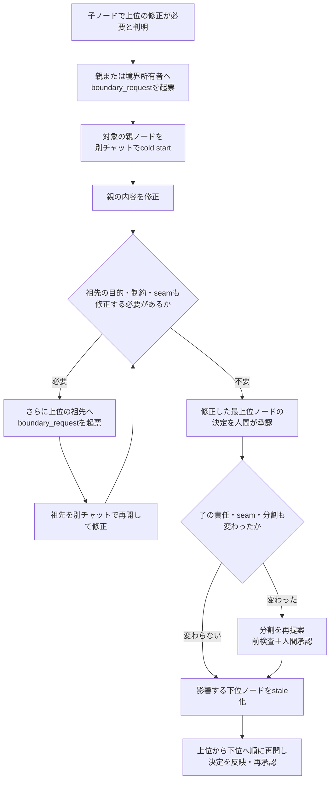

# 設計ハーネス（根）

## 1. これは何を決めるものか

これは設計書をAIと対話的に作るためのハーネス。

## 2. なぜ要るのか

AIエンジニアリングは開発を加速させるが、システムがどう動いているのかを人間側が理解していない。
また、それらの機能に対し自分の想定と違うものができることや、想定していない不具合が細部において存在する。
こういった理由から「自分で作ったもの」ではなく「AIが作ったもの」となっていしまっている。

## 3. 誰が使い、誰が影響を受けるか

エンジニアが現状のターゲット。
今後はより一般人が使うことを目標としている。

# 基本構造

まず、テンプレートの質問で構成される根。
根に対してどのような課題があるのかが深さ1のMDファイル。
それに対する解決法が深さ2のMDファイル。
解決法を実現する具体的なシステムが深さ3のMDファイル。

| 深さ | 意味 | その階層で決めること |
| --- | --- | --- |
| 0 | 根 | ペイン、目的、利用者、成功条件、不変条件 |
| 1 | 課題 | 根の目的を達成するために解くべき課題と、その課題への解決法 |
| 2 | 解決法 | 承認された解決法と、それを実現するシステム |
| 3 | システム | 実装可能な境界、振る舞い、受け入れ条件 |

Interview、Split、Precheck、Review、Implement は設計ツリーのノードではない。
これらは、各階層のノードに対して処理を行うハーネス側の役割である。

# 基本的な使用フロー

```mermaid
flowchart TD
    A["固定質問7個に答える"] --> B["深さ0：根を構成<br/>ペイン・目的・成功条件"]
    B --> C{"人間：根の決定を承認"}
    C -- "修正" --> A
    C -- "承認" --> D["深さ1の課題への分割を提案"]
    D --> E["別実装AIが分割を前検査"]
    E --> F{"人間：課題への分割を承認"}
    F -- "修正・却下" --> D
    F -- "承認" --> G["深さ1：課題ノードを作成<br/>課題ごとに個別チャット"]

    G --> H["課題に対する解決法を決定"]
    H --> I{"人間：解決法の決定を承認"}
    I -- "修正" --> H
    I -- "承認" --> J["深さ2の解決法への分割を提案"]
    J --> K["別実装AIが分割を前検査"]
    K --> L{"人間：解決法への分割を承認"}
    L -- "修正・却下" --> J
    L -- "承認" --> M["深さ2：解決法ノードを作成<br/>解決法ごとに個別チャット"]

    M --> N["解決法を具体的なシステムへ落とし込む"]
    N --> O{"人間：システム化の決定を承認"}
    O -- "修正" --> N
    O -- "承認" --> P["深さ3のシステムへの分割を提案"]
    P --> Q["別実装AIが分割を前検査"]
    Q --> R{"人間：システムへの分割を承認"}
    R -- "修正・却下" --> P
    R -- "承認" --> S["深さ3：システムノードを作成<br/>システムごとに個別チャット"]

    S --> T["システムの境界・振る舞い・<br/>受け入れ条件を具体化"]
    T --> U{"人間：システムの決定を承認"}
    U -- "修正" --> T
    U -- "承認" --> V["実装へ渡せる葉として確定"]
```

決定の承認と分割の承認は別の承認として扱う。決定が承認される前に分割してはならず、
分割が承認される前に子ノードを作ってはならない。

# 親・祖先の修正フロー

子ノードを検討した結果、親の内容が誤っている、または親の境界では成立しないと分かった場合、
子のチャットから親の本文を直接編集しない。親ノードを別チャットで再開し、親自身として修正する。

親や祖先を書き換えた場合、その変更の影響を受ける子孫は古い決定のまま続行しない。
必要な最上位の祖先から承認を取り直し、上から下へ順に内容を確定させる。
