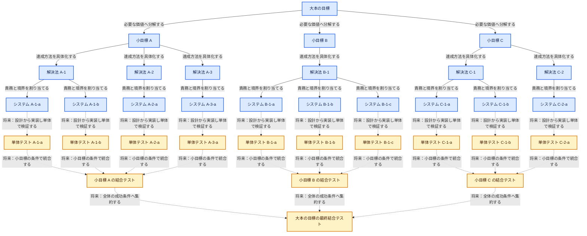

# AIDE v2 マスター設計

> 状態: current
>
> 今回の実装範囲: 設計ハーネスと設計成果物の契約
>
> 実行規約: `../harness-v2/`
>
> 今回作らないもの: 製品コード、単体テスト、結合テスト、テスト実行基盤

## 1. 目的

AIDE v2 は、曖昧な大本の目標を、追跡可能で実装可能な設計ツリーへ変換する。
設計は `大本の目標 → 小目標 → アプローチ・解決法 → システム` の順に具体化し、
各ノードへ現在有効な設計と、その設計を選んだ根拠を残す。

今回の完了地点は、すべての必要な枝がシステム設計へ到達し、各システムを将来の
作成ハーネスへ渡せる状態である。公開判定は、構造検査と意味検査に合格した版を
orchestrator が自動的に正本化することで行う。

## 2. 全体像

設計側は問題に応じて非対称に分岐する。将来の検証側は、その所有境界を逆方向にたどる。
図中の矢印ラベルは、その接続で実行する行動を示す。



- 青: `harness-v2` が今回完成させる設計範囲
- 黄: 将来の作成・検証ハーネスが扱う範囲
- 実線: 今回定義する設計分解
- 点線: 将来の実装・検証への対応関係

## 3. 設計ツリーの4階層

| 深さ | 種類 | この層で決めること | 次へ渡すもの |
| --- | --- | --- | --- |
| 0 | `root_goal` | 利用者、実現する状態、最終成功条件、不変条件 | 必要な小目標と全体統合条件 |
| 1 | `subgoal` | 独立して確認できる価値または課題 | 解決法の評価条件と小目標の統合条件 |
| 2 | `approach` | 小目標を満たす原理、方針、責務の組合せ | システム境界と選択理由 |
| 3 | `system` | 実装可能な責務、I/O、依存、例外、品質条件 | 将来の作成ハーネスへ渡す設計閉包 |

深さの意味は固定し、子数は固定しない。抽象度が変わるなら子が1つでも分解し、
見た目を揃えるためのダミーノードは作らない。

## 4. 親子エッジ

各親子エッジは、単なる線ではなく、親の条件を子へ割り当てる契約である。

| `relation` | 意味 | 完了条件への影響 |
| --- | --- | --- |
| `all_of` | 子が共同で親を成立させる | 必須の子をすべて成立させる |
| `one_of` | 複数の代替案から選ぶ | 選択規則に合う子を1つ成立させる |
| `optional` | 成功条件外の拡張 | 未採用でも親を未完了にしない |

エッジには `id`、`relation`、`group`、`selected`、責務、期待する成果、子へ渡す
受入条件IDと制約を記録する。`one_of` は同じ group 内で1つだけを選択する。
`review-ready` 以降の design の children は、検査前に staged materialize 済みとなった
選択枝だけを参照する。未選択候補と比較理由は `rationale.md` に残す。親に残す統合責任も
明記する。staged child は親が published になるまで処理対象にせず、親の公開と同じ論理更新で
active にする。

seam の完全な契約は owner の `design.md` だけを正本とする。from / to の参加ノードは
seam id、owner、revision、参加 role を参照し、契約本文を複製しない。

## 5. 各ノードの成果物

生成されるすべての設計ノードは、次の2ファイルを所有する。

```text
<node>/
├─ design.md      現在有効な設計本体
└─ rationale.md   根拠、仮定、代替案、検査結果、変更理由
```

`design.md` は下位設計または将来の作成に対する規範であり、単独で読んでも責務と
受入条件が分かるようにする。`rationale.md` はその版を選んだ理由を説明するが、
`design.md` の仕様を上書きしない。実行中の一時的な文脈だけに存在する決定は正本ではない。

`design-v2/tree/**/index.md` は、ハーネス自身を設計した既存メタツリーである。
生成対象のファイル契約とは区別し、移行が完了するまで `index.md` 形式を維持する。

## 6. 状態と自動公開

| 状態 | 意味 | 次の処理 |
| --- | --- | --- |
| `draft` | 設計を起草・修正中 | author が必須項目を埋める |
| `review-ready` | 検査対象の版が固定された | precheck と review を実行する |
| `validated` | 現在の親版に対する検査が合格した | orchestrator が競合を確認する |
| `published` | 現在有効な正本 | 分解または設計閉包の作成へ進む |
| `blocked` | 根拠ある設計に必要な情報がない | 理由と解除条件を残し、別ノードを進める |
| `stale` | 上位・依存・seam の変更で再検査が必要 | 影響箇所を `draft` へ戻す |
| `superseded` | 過去に published だったノードが後継に置き換えられた | 読み取り専用で保持する |

`review-ready → validated` は検査結果で決まる。検査に失敗した版は、指摘を
`rationale.md` に残して `draft` へ戻す。`validated → published` は、検査対象の親版と
現在版が一致するとき orchestrator が自動的に行う。利用者からの追加・修正指示は
いつでも新しい入力イベントとして取り込み、影響範囲を再設計する。

2文書は `revision` と `design_revision` を共有する。`revision` は状態・検査結果を含む
論理更新ごとに増やし、`design_revision` は設計、根拠、分解候補の意味が変わったときだけ
増やす。検査は immutable な authoring closure を固定し、そのIDが対象 design revision、親の
design revision、dependency の design revision、seam revision、tree revision を束ねる。
結果記録による revision 更新だけでは検査対象を失効させない。

`base_revision` は各書込み操作の楽観ロックにだけ使う。公開判定は authoring closure の版集合と、
書込み直前に読み直した通常 revision の両方を確認する。

`handoff-ready` はノード状態にせず、published system の immutable closure に対応する
別レコードの `result: pass` という派生判定で表す。

## 7. 設計検査

公開前に最低限、次を検査する。

1. 種類ごとの必須節が埋まっている
2. 親から割り当てられた受入条件と制約を被覆している
3. 子同士の責務に説明できない重複や隙間がない
4. `all_of`、`one_of`、`optional` の意味と選択規則が明示されている
5. seam の送り手、受け手、内容、版、所有者が一意で、完全な契約が owner にだけある
6. 仮定、代替案、不採用理由、未解決事項が根拠側に残っている
7. システムノードが単独で実装開始できる境界を持つ
8. 祖先、dependency、seam、invalidation を含む対象 authoring closure と基準だけで同じ判断を再検査できる

検査主体の属性ではなく、対象版、入力、基準、結果が記録されていることを要件とする。

## 8. 今回の設計完了条件

- 根からすべての採用済みシステムへ到達できる
- すべての生成ノードに `design.md` と `rationale.md` がある
- 必須ノードがすべて `published` で、重大な未解決事項がない
- 親の条件が子または親の統合責任へ漏れなく割り当てられている
- 各システムに責務、境界、I/O、依存、例外、品質条件、受入条件がある
- 各システムの設計閉包を保存ファイルだけから再構成できる
- 各 current system closure に対応する handoff result が `pass` である
- 将来の単体・小目標結合・最終結合への対応先が識別できる

## 9. 将来フェーズへの接続

今回は次の成果物を生成・実行せず、対応規則だけを設計に残す。

1. `system` ごとに実装成果物と単体テストを1対1で対応させる
2. `subgoal` ごとに、その達成に必要な採用済みシステムを結合テストへ集約する
3. `root_goal` の最終成功条件を、小目標の結合結果を束ねる最終結合テストへ対応させる
4. `one_of` は採用された枝だけを検証対象とし、`optional` は採用状態を明示する

ID は system が `UT-<system-id>`、subgoal が `SIT-<subgoal-id>`、root が
`FIT-<root-id>` を所有する。approach 自身に必須テストIDは持たせず、system closure が
祖先由来の3 IDをまとめて参照する。

この全体形は V モデルに近い。各システム内部でテストを先に書く場合は TDD、
小目標や大本の目標の受入条件を先に固定する部分は ATDD と組み合わせられる。

## 10. 正本

- 全体構造とスコープ: この `master.md`
- ハーネスのメタ設計: `tree/index.md` と、その current な子
- 実行手順と成果物テンプレート: `../harness-v2/`
- 過去の検討材料: `lanes/`、`pool-archive.md`、Git 履歴（非規範）
