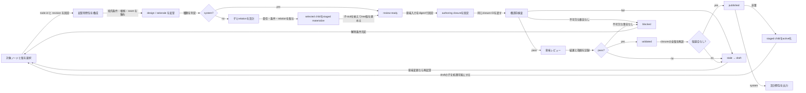

# authoring — 目標を設計ツリーへ変換する

## 1. 責任

入力された大本の目標を、`root_goal → subgoal → approach → system` の設計ツリーへ
具体化する。各ノードでは現在有効な設計と判断根拠を分離し、親の条件がどの子または
親の統合責任に割り当てられたかを追跡可能にする。

## 2. 入力と出力

### 入力

- 大本の目標、対象利用者、望む状態
- 明示された制約、優先度、成功条件
- 利用可能な既存設計、調査結果、技術・業務上の事実
- `s2.design-gap`: 引渡し検査で見つかった設計不足
- `s5.invalidation`: 変更により再設計が必要になった範囲

### 出力

- ノードごとの `design.md` と `rationale.md`
- `relation` と条件割当を持つ親子エッジ
- ノード間の seam と依存関係
- `s1.design-closure`: published な system と祖先の閉包
- `s3.change-event`: 公開版間で変化した契約

## 3. 分解規則

1. 根では、成功状態と最終受入条件を定義する
2. 根の成立に必要な独立した価値を `subgoal` にする
3. 各小目標を満たす方針または解決原理を `approach` にする
4. 各方針を実装可能な責務境界へ割り、`system` にする
5. 各エッジへ `all_of | one_of | optional` を設定する
6. 親の条件IDを、子または親に残す統合条件へ漏れなく割り当てる
7. 枝ごとに必要な子数を選び、均等な形を目的に分割しない

`one_of` は非nullの group、比較基準、選択規則を `rationale.md` に記録し、同じ group で
1つだけを選ぶ。未選択枝はノード状態にせず、理由とともに代替案へ残す。`optional` は
採用有無が親の完了判定を変えないことを明示する。

## 4. 作成ループ

## 5. 自動公開条件

次をすべて満たす候補版を `validated` とする。

- 種類ごとの必須節が存在する
- 親から割り当てられた条件と制約を満たす
- 設計本体と根拠の間に矛盾がない
- 責任境界、依存、seam、受入条件が検証可能な文で書かれている
- 重大な指摘が残っていない
- 未解決事項が、委任可能・将来スコープ・`blocked` のいずれかに分類されている

orchestrator は、structural / semantic が同じ authoring closure IDへ pass していることを確認する。
さらに対象 design revision、親 design revision、dependency design revision、seam revision、
tree revision が manifest と一致し、対象2文書の通常 revision が書込み開始時から変わっていない
場合だけ `published` へ進める。不一致なら `stale → draft` として新しい閉包で再検査する。

非葉では decompose の完了時に選択済み child の2文書を staged stub として materialize する。
precheck は参照先の実在を検査し、親を published にする論理更新で staged child を active にする。
親が未公開の間、orchestrator はその child を起草対象に選ばない。

## 6. 子の責任

| 子 | 責任 |
| --- | --- |
| `authoring.node` | 4種類のノードと2文書の内容、状態、条件割当を定義する |
| `authoring.closure` | 起草・検査・引渡しに必要なファイル集合を版付きで構成する |

### 内部 seam

| id | from → to | 内容 |
| --- | --- | --- |
| `a1.context-closure` | `closure → node` | 対象、祖先、関連 seam、依存、条件割当の版付き集合 |
| `a2.node-snapshot` | `node → closure` | candidate または published node の design revision と意味入力 |

## 7. 完了条件

- 任意の大本の目標から4種類のノードを作る手順が一意である
- 非対称な分岐と代替枝を表現できる
- 各条件を根から system まで追跡できる
- system から根へ存在理由と成功条件を逆引きできる
- 検査不合格、競合、変更、設計ギャップが修正ループへ戻る
- published な system ごとに再構成可能な設計閉包を出力できる

## 8. 今回の境界

authoring は設計と将来検証への対応IDまでを作る。実装コード、テストケース、テストコード、
実行環境は生成しない。
