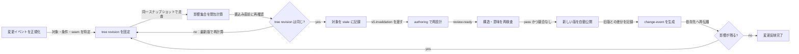

# change — 変更影響を計算し設計を再公開する

## 1. 責任

新しい要求、事実、設計ギャップ、または公開済み契約の変更を版付きイベントとして受け取り、
影響するノードと設計閉包を決定する。影響範囲を `stale` として authoring へ戻し、
再検査された版だけを新しい正本にする。

## 2. 変更イベント

```yaml
event_id: <unique-id>
processing: pending | blocked | complete
tree_revision: <revision-used-for-impact-analysis>
source: user-input | new-evidence | design-gap | boundary-request | node-publication
target_nodes: [<node-id>]
before: [<node-design-revision>]
proposed_change: <changed-goal-constraint-contract-or-fact>
changed_conditions: [<condition-id>]
changed_seams: [<seam-id>]
reason: <why-change-is-needed>
```

event は `design-tree/changes/events/<event-id>.md`、impact set は
`design-tree/changes/impacts/<event-id>.md`、invalidation は
`design-tree/changes/invalidations/<invalidation-id>.md` に保存する。未処理IDと有効な
invalidation は `tree-state.md` から参照する。

利用者からの追加・訂正は `user-input` として記録し、既存設計より優先して矛盾を解消する。
ただし、どの設計がなぜ失効したかは impact set に残す。

## 3. 影響集合

基準となる `tree_revision` に対して、次の順で集合を閉じる。

1. `target_nodes` を直接影響へ加える
2. 変更された条件・制約を継承する子孫を加える
3. 変更された出力、依存、seam を利用するノードを加える
4. 子の条件被覆や統合責任が変わる祖先を加える
5. 上記ノードの旧 design revision を参照する closure IDを失効対象へ加える
6. 追加された各ノードについて 2〜5 を繰り返し、集合が変わらなくなったら停止する

単なる本文表現の変更で、条件、責任、I/O、依存、seam、受入条件が変わらない場合は、
意味的な影響なしと判断できる。その判断と比較根拠も記録する。

### impact set の出力

```yaml
event_id: <source-event-id>
based_on_tree_revision: <tree-revision>
stale_nodes:
  - id: <node-id>
    design_revision: <old-design-revision>
    reason: <dependency-path-or-condition>
invalid_closures: [<closure-id>]
unaffected_evidence: [<why-nearby-node-is-safe>]
```

## 4. 反映フロー



## 5. 書込みの原子性

影響計算中に tree revision が変わった場合、その計算結果は正本へ反映せず、最新版で再計算する。
反映時は次を1つの論理更新として扱う。

1. event と impact set を保存する
2. 影響ノードの current design revision を `stale` として記録する
3. 対応する immutable closure IDと handoff result を無効化する
4. authoring の再設計キューへ node id / design revision / reason を渡す
5. tree revision を進める

保存方式やロック方式は実装へ委任するが、新旧版の一部だけが current に見える状態を
正常完了としてはならない。

## 6. 再公開

再設計ノードは通常の `draft → review-ready → validated → published` を通る。
変更対象だけを検査するのではなく、impact set に含まれる親の条件被覆、依存先の契約、
関連 seam も再検査する。新しい版の公開後、その差分から後続 change event を生成し、
新たな影響がなくなるまで繰り返す。

同じ node id の設計改訂では、Git履歴と design revision で旧版を追跡する。構造変更で別IDの
後継nodeへ置き換える場合は、過去に published だった旧nodeをまず `stale` とし、後継nodeの
公開と同じ tree 更新で `stale → superseded` にする。未公開候補には superseded を使わない。

## 7. 失敗時の扱い

| 状況 | 処理 |
| --- | --- |
| 対象 node または design revision が存在しない | event の `processing: blocked` と欠落を記録する |
| 影響経路を一意に決められない | 安全側の候補を列挙し、境界 owner を `blocked` にする |
| 版競合が起きた | 書き込まず、最新 tree revision で再計算する |
| 再設計で重大指摘が残る | 対象は published にせず、別の独立ノードを進める |
| 変更を取り消す | 取り消し自体を新イベントとし、現在版から影響を再計算する |

## 8. 完了条件

- 変更イベントから影響ノードと失効 closure を再現できる
- 影響あり・なしの両方に根拠がある
- 祖先条件、子孫継承、依存、seam の4経路を扱える
- 競合した計算結果を current な設計へ混入させない
- 再設計された全ノードが通常の検査・公開フローを通る
- 影響集合が空になった tree revision を最終結果として示せる

## 9. 旧子ノード

旧 `change.impact` と `change.propagate` の責任はこの文書へ統合した。
両文書は `superseded` スタブとして後継先だけを示す。
