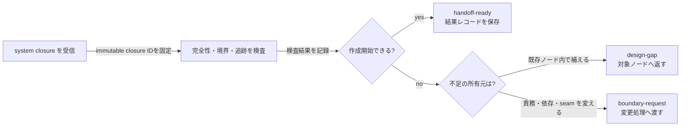

# handoff — システム設計を自己完結した入力へ変換する

## 1. 責任

published な system closure を受け取り、将来の作成工程が追加の暗黙知なしに実装計画を
開始できるか検査する。handoff は設計を勝手に補完せず、不足を所有ノードへ返す。

## 2. 入力

`s1.design-closure` として次を受け取る。

- 対象 system の id と design revision
- root → subgoal → approach → system の design / rationale
- 親子エッジの relation と条件割当
- system の責務、非責務、I/O、依存、seam、例外、品質条件
- 各階層の受入条件と、親に残された統合条件
- closure manifest と tree revision
- 将来の unit / subgoal integration / final integration の対応ID

## 3. 検査

| 観点 | pass 条件 |
| --- | --- |
| 完全性 | manifest の全ファイルと参照版が存在する |
| 一貫性 | design と rationale、親版と子版に矛盾がない |
| 境界 | system の責務・非責務と外部接続点が明確である |
| 実装可能性 | 入力、出力、状態、エラー、品質条件、受入条件が観測可能である |
| 依存 | 依存先、方向、契約、版、owner が特定できる |
| 追跡 | system の各条件を上位の目的へ逆引きできる |
| 将来検証 | 3段階の検証対応IDと所有元を特定できる |
| 未解決事項 | 実装開始を阻害する重大事項が残っていない |

実装言語など system が明示的に委任した判断は欠落に数えない。委任範囲と受入条件が
不明確な場合は欠落とする。

## 4. 判定とルーティング



### `s2.design-gap`

次を含めて authoring へ返す。

```yaml
gap_id: <unique-id>
target_node: <node-id>
target_design_revision: <design-revision>
missing_decision: <what-is-missing>
blocked_conditions: [<condition-id>]
evidence: <why-it-is-needed>
done_when: <observable-resolution>
```

### `s4.boundary-request`

責務、親子割当、依存、seam の変更が必要な場合に change へ渡す。

```yaml
request_id: <unique-id>
tree_revision: <tree-revision>
owned_by: <boundary-owner-node>
requested_change: <contract-change>
reason: <why-current-boundary-fails>
affected_conditions: [<condition-id>]
```

## 5. `handoff-ready` の意味

`handoff-ready` は設計閉包に対する派生判定であり、node status を増やさない。
immutable な closure manifest 自体は変更せず、
`design-tree/closures/handoffs/<closure-id>.md` に次の結果を保存する。

```yaml
handoff_id: HO-<closure-id>
closure_id: <closure-id>
result: pending | pass | fail
checked_system_design_revision: <design-revision>
checked_tree_revision: <tree-revision>
finding_ids: []
```

結果の system / tree revision は参照 closure と一致させる。対象、依存、seam、tree の意味版が
変わればこの判定は失効し、新しい closure IDを検査する。

## 6. 完了条件

- system ごとに独立した closure manifest を作れる
- 同じ入力版に対して同じ欠落分類を再現できる
- system 内で補う不足と、境界変更が必要な不足を区別できる
- 不足を具体的な node、design revision、condition へ戻せる
- pass した closure だけを将来の作成ハーネスへ渡せる
- handoff 自身は製品コード、模擬実装、テストを作らない

## 7. 旧子ノード

旧 `handoff.detect` と `handoff.gate` の責任はこの文書へ統合した。
両文書は `superseded` スタブとして後継先だけを示す。
