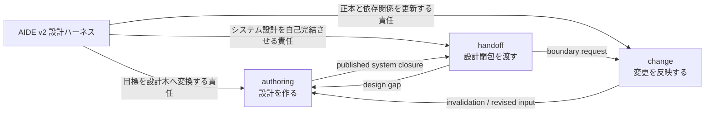
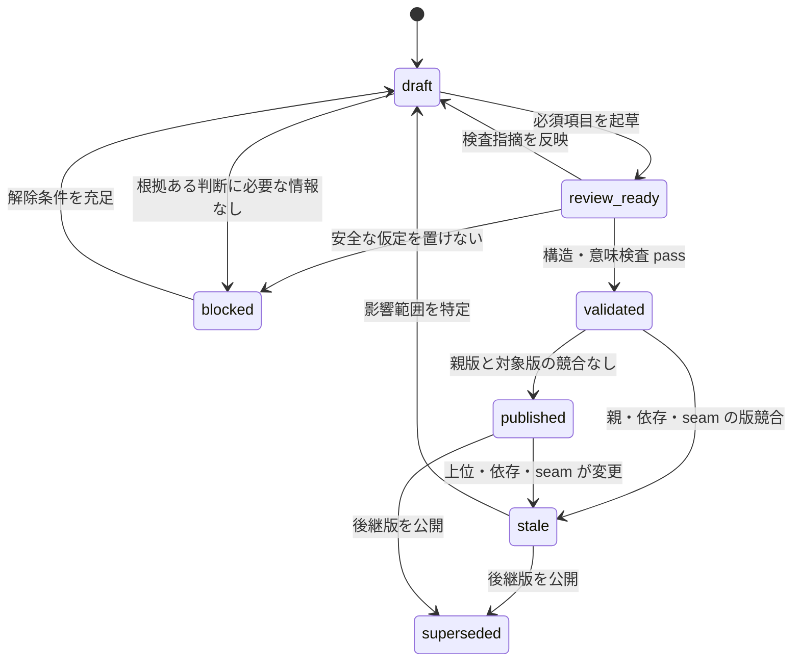
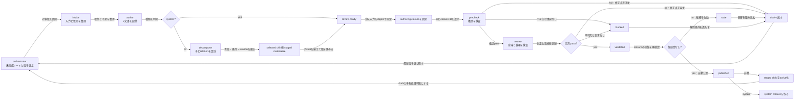

# AIDE v2 設計ハーネス

## 1. このメタ設計の責任

このツリーは、AIDE v2 が大本の目標をシステム設計まで具体化し、その設計を安全に
更新・引き渡す仕組みを定義する。生成されるプロジェクトの4階層ツリーそのものではなく、
そのツリーを作るハーネスの責任分解である。



## 2. 生成する構造

```text
大本の目標 → 小目標 → アプローチ・解決法 → システム
```

生成ノードの種類は `root_goal`、`subgoal`、`approach`、`system` の4つとする。
分岐数は責任境界によって決まり、枝ごとに異なってよい。親子エッジは
`all_of | one_of | optional` のいずれかを持つ。

生成ノードは次の2ファイルを正本とする。

```text
<node>/
├─ design.md
└─ rationale.md
```

生成ツリーの根には、node revision と分離した `tree-state.md` を置く。ここが通常の
`revision`、意味上の `tree_revision`、active root、staged child、pending change event、
active invalidation、system closure の現在性を持つ。通常 revision はファイル更新ごと、
tree revision は設計グラフ、公開契約、staged/active membership、失効が変わるときだけ増やす。
検査結果や closure 登録だけでは tree revision を増やさない。

この `design-v2/tree/` は既存メタ設計のため `index.md` 形式を維持するが、
新しいプロジェクトへ `index.md` 形式をコピーしない。

## 3. 不変条件

1. 状態の正本は保存された設計ファイルにある
2. `design.md` は現在有効な仕様、`rationale.md` はその理由を持つ
3. 親から子へ渡す条件と、親に残す統合責任を同時に記録する
4. 子は親の目的を詳細化し、別の目的へ置き換えない
5. 見た目を揃える目的で枝や中間ノードを追加しない
6. seam の完全な契約は owner だけが持ち、参加ノードは id、owner、版、role で参照する
7. 重要な仮定と未解決事項は根拠側へ残す
8. 構造検査と意味検査に合格した版だけを公開する
9. 実行プロセスの一時状態を設計判断の正本にしない
10. 今回は設計成果物までとし、コードとテストを生成しない

## 4. 状態モデル



文書上の値は `review-ready` を使う。Mermaid の `review_ready` は識別子上の表記である。
検査不合格は終了ではなく、指摘を `rationale.md` に記録して修正ループへ戻す。
`superseded` は過去に published だったノードが後継へ置き換えられた場合だけに使う。
構造変更で一度 stale になった旧ノードは、後継公開と同じ論理更新で superseded にできる。
未選択の分解候補はノード状態にせず、rationale の代替案に残す。

2文書は `revision` と `design_revision` を共有する。前者は状態・検査結果を含む論理更新、
後者は設計・根拠・分解候補の意味変更で増やす。検査は design revision と parent revision を
固定するため、検査結果を書き込む revision 更新だけでは対象を失効させない。

## 5. 子の責任

| 子 | 責任 | 主な出力 |
| --- | --- | --- |
| `authoring` | 目的を非対称な4階層設計へ具体化する | `design.md`、`rationale.md`、親子エッジ、seam |
| `handoff` | published なシステムから自己完結した設計閉包を作る | closure manifest、設計ギャップ |
| `change` | 新しい入力や依存変更の影響を計算し正本を更新する | change event、impact set、invalidation |

## 6. seam 契約

| id | from → to | 内容 | 受理条件 |
| --- | --- | --- | --- |
| `s1.design-closure` | `authoring → handoff` | system と祖先の版、設計、根拠、seam、受入条件 | 全対象が `published` |
| `s2.design-gap` | `handoff → authoring` | 不足する決定、必要な所有者、阻害される条件 | 対象 node/revision が明示される |
| `s3.change-event` | `authoring → change` | 旧版、新版、変化した契約、理由 | 一意な event id を持つ |
| `s4.boundary-request` | `handoff → change` | 既存の責務・依存・seam の変更要求 | 要求範囲と理由が明示される |
| `s5.invalidation` | `change → authoring` | `stale` にするノード集合、根拠、再検査条件 | 基準となる tree revision を持つ |

seam の受信は自動的な採用を意味しない。担当が整合性を検査し、通常の公開フローで
正本へ反映する。

## 7. 実行フロー



## 8. 完了条件

- `authoring` が4階層と2文書の契約を一意に実行できる
- `handoff` が保存ファイルだけから system closure を構成できる
- `change` が上位変更と seam 変更の影響範囲を決定できる
- `harness-v2/` がこの3責任を自己完結した手順として実装している
- active な文書間で状態語彙、ファイル名、seam 名、公開条件が一致する
- 旧方針を含む文書は `superseded` とされ、規範として参照されない

## 9. 今回の境界

将来は `system → 単体テスト → subgoal 結合テスト → root_goal 最終結合テスト` を
設計ツリーへ対応させる。今回は対応先の識別規則までを定義し、テスト成果物は作らない。
