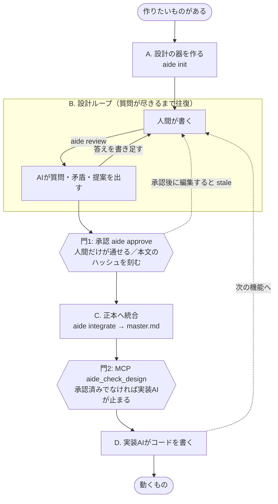

# AIDE の設計工程

設計: Daichi Fukuhara / 2026-08-19 / 状態: 工程について合意。実装はこれから

> 承認されていない設計では、実装が始まらない。
> 工程はこの一文を成立させるためだけにある。

図版: <https://claude.ai/code/artifact/0b70761d-b8ad-46d3-977f-2eb22acda934>

---

## 全体は4段階

| | 段階 | やること | 誰が |
|---|---|---|---|
| A | 器を作る | `aide init` | 最初の一度だけ |
| B | **設計ループ** | レーンを切る → 人間が書く → AIが聞く → 人間が答える | 人間とAIの往復 |
| C | 確定する | `aide approve` → `aide integrate` | 人間 |
| D | 実装する | 実装AIがMCP経由で承認済み設計を受け取って書く | 実装AI |

ただし直線ではない。**Bを何度も回り、2つの門を通る。**



---

## 2つのループ

### 内側のループ（Bの中）

書く → `aide review` → AIが質問 → 答えを書き足す → また review。**質問が尽きるまで**回す。

**これがAIDEの本体。** ここで「AIが暗黙に決めるはずだったこと」が人間の判断に変わる。
終了条件がAIの側にあるので、人間が「もう十分だろう」と自己判断して打ち切ることにならない。

### 外側のループ（D → B）

実装が終わったら次の機能。新しいレーンを足してBに戻る。`master.md` が育つ。

---

## 2つの門

### 門1 — 承認（`aide approve`）

**人間だけが通せる。** AIは設計を書けないし、承認もできない。
通過の記録がハッシュとして残る。これが「制作者が責任を引き受ける」の具体形であり、
後から「そんなつもりではなかった」と言えなくする仕掛け。

レビューを通していない、あるいは最新レビューが本文とズレているレーンは、ここで弾かれる。

### 門2 — MCP（`aide_check_design`）

**承認済みでないと通れない。** 実装AIが承認されていないことを勝手に作れない。

```
"ログイン画面を作って"       → covered     stopRequired: false → 実装してよい
"パスワードリセットを作って"  → unknown     stopRequired: true  → 止まる
"レート制限を実装して"       → draft_only  stopRequired: true  → 下書きは仕様ではない
```

**他の機能はすべてこの2つの門を機能させるための支え。**
レーン分割も、履歴も、stale検出も、バックエンド交換も。門が無ければAIDEはただのMarkdownフォルダになる。

> **限界**: 門2に強制力はない。実装AIが「聞けば」止まるが、聞かずにファイルを書くのは防げない。
> 確実に止めるには pre-write hook か CI が別途必要になる。

---

## 実例: ログイン機能

### A. 器を作る（最初の一度だけ）

```sh
$ aide init
design/ を作成しました
  master.md      （空の正本）
  lanes/
  reviews/
  history.jsonl
```

### B-1. 論点を切り出す（人間）

```sh
$ aide lane login
design/lanes/login.md を作成しました (status: draft)
```

一度に全部考えない。「ログイン」「データ保存」「画面遷移」のように、
**独立して考えられる単位**に割る。最小版では人間が割る。

### B-2. 書く（人間）

テンプレートに沿って埋める。**ここがドメインを知る人の持ち場で、コードは1行も書かない。**

```md
## 目的
ユーザーがメールアドレスとパスワードでログインできる。

## 決めること
- パスワードは8文字以上
- ログイン失敗は5回でロック

## データの取り扱い
（必須欄。空のままでは承認できない）
```

### B-3. AIに読ませる（AI）

```sh
$ aide review design/lanes/login.md
→ reviews/login-1.md を作成
→ lanes/login.md は変更していません
```

AIが出すのは3種類。

- **質問** — 「ロックは何分で解除されますか。恒久ロックですか」
- **矛盾** — `master.md` や他のレーンとの衝突
- **提案** — 「パスワードの保存方式が未記載です」

> AIの出力は `reviews/` にしか存在しない。人間が書いた `lanes/login.md` は**開かれてすらいない**。
> これが「AIが勝手に変更しない」の実体で、行儀の良さではなく構造で保証している。

### B-4. 答えて、また読ませる（人間 → AI）

```sh
$ aide review design/lanes/login.md
→ reviews/login-2.md を作成

## 質問
なし
```

### 門1. 承認する（人間だけ）

```sh
$ aide approve design/lanes/login.md
承認しました
  hash: 8c41e0a2...
  history.jsonl に記録
```

### C. 正本に載せる（機械的）

```sh
$ aide integrate
master.md へ統合しました
  ## login  (新規)
```

見出し単位で差し替えるだけの決定的な処理。AIを使わないので、
**ここまでの工程はAIが1回も呼べない環境でも完結する。**

### 門2 → D. 実装AIが問い合わせて、書く

実装AIは**仕様を推測しない**。承認済みの本文だけを根拠にする。
「何を作るか」は決着済みなので、「どう効率よく実現するか」に集中できる。

---

## 2回目以降

| 状況 | どこに戻るか | 何が起きるか |
|---|---|---|
| 次の機能を作る | B へ | 新しいレーンを足す。既存の `master.md` と矛盾すればB-3で検出される |
| 承認後に本文を編集した | B へ（強制） | ハッシュが変わり `stale`。再レビュー・再承認するまで実装AIは古い設計を見続ける |
| レビューで矛盾が出た | B に留まる | 矛盾を解消するまで門1を通れない |
| 設計が大きくなりすぎた | B で分割 | レーンを割って考える範囲を小さくする |

つまり **`master.md` は機能が増えるたびに育ち、その全部が「人間が一度は承認したもの」だけで構成される。**
これが最後まで保たれることが、AIDEが成立しているかどうかの判定になる。

---

この設計に対する最終的な責任は設計者が持つ。
AIDEが人間に求めることを、AIDE自身の設計書も守る。
