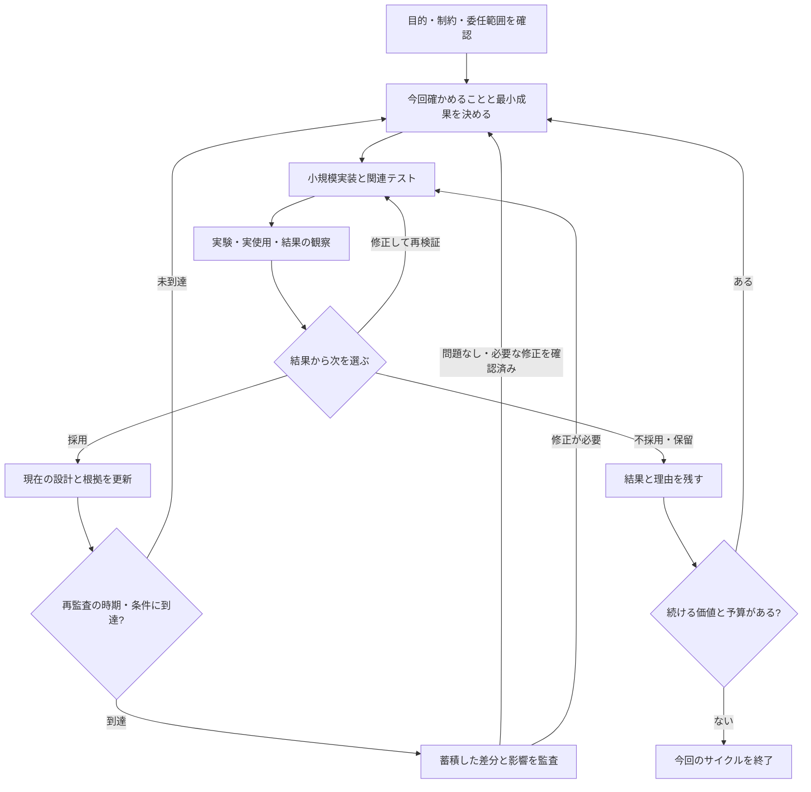

# AIDE v3 草案 — 実験と運用から設計を育てる

作成日: 2026-09-16  
状態: 検討用の草案。実行規約・採用済み仕様ではない。  
出発点: [現在のv2設計](harness-v2-design.md)と[実行規約](../harness-v2/README.md)。

## 1. v3が目指すもの

**小規模実装と運用で確かめたことを設計へ反映し、その設計を使って次の改善を進める開発ハーネス。**

人間が、何を作っているか・なぜそうしたか・何が未確認かを把握できるというAIDEの目的を引き継ぐ。実装前の設計に加え、実装・テスト・実使用から得た証拠で設計を更新するところまでを一つの流れにする。

中心に置くのは、今回ユーザーから挙がった三つの案。

1. **小規模実装と運用の結果をマスター設計書へ反映する。** 実験→修正→反映を繰り返し、出力を安定させるためのテストも作る。
2. **監査済みの範囲では細かな修正を進め、定期的に再監査する。** 変更のたびに一連の監査を繰り返す負担を減らす。
3. **設計書の分割にドメイン駆動の考え方を使う。** 扱う概念・ルール・責任のまとまりから境界を決める。

以下の具体的な構成、監査条件、進め方は、この三案をつなぐための提案であり未確定。

## 2. v2からの発展

| 観点 | 現在のv2 | v3の案 |
| --- | --- | --- |
| 到達点 | 実装可能な設計と引渡し用の設計閉包 | 小規模実装、テスト、運用結果、それを反映した設計 |
| 進行 | 目標から必要な設計を具体化して引き渡す | 次に確かめることを選び、実験と設計更新を繰り返す |
| 設計の構造 | root_goal→subgoal→approach→systemの4階層 | 目標との対応を残し、ドメインごとに詳細を持つ |
| 方法の選択 | 設計段階で候補を比較・選択する | 小規模実装・運用の証拠も使って選び直せる |
| 検証 | 将来の単体・結合テストとの対応IDを設計する | 必要なテストを実装・実行し、実使用の評価と合わせて判断する |
| 正本化と監査 | 構造・意味検査に合格した同一版を自動で正本化 | 初回監査後は、対象範囲内の小変更を反映し、差分を定期監査する |
| 変更の影響 | 目的・依存・契約の変更を追跡して再検査する | 追跡を維持し、日常確認・境界の確認・定期監査を使い分ける |

現行v2は、各段階で人間の承認を必須にする旧ハーネスから進んでいる。v3の主な追加価値は、実装と運用による学習を組み込み、変更ごとの検査負担を調整することにある。

設計と根拠の分離、契約の所有者、条件の追跡、古い版との混同防止は引き継ぐ。目標・課題・方法・システムという考える順序も使えるが、それぞれを必ず別階層の文書にするかは見直す。

## 3. 基本の開発ループ



一回で扱うのは「次の判断に必要な最小の成果」。接続だけが不明なら接続を試し、利用価値が不明なら入力から役立つ結果までを通して試す。一回の実験が複数ドメインを跨いでもよい。

着手時には、目的、最小成果、比較対象、確認方法、必要な予算上限、続行・変更・終了の条件を短く置く。既存の依頼から分かることは再質問しない。合意済みの範囲で方法を変えるたびに、人間へ採否を戻す運用にはしない。

不採用の実験も、次に試さなくてよい方法や成立条件が分かれば成果になる。作業上限に達した場合は、結果と未確認事項を残し、追加作業が既存の委任に含まれるかで次を判断する。

## 4. マスター設計書の役割

マスターは、現在どのようなものを作っているかが分かる全体の入口とする。

- 全体の目的、利用者、成功条件、守る条件。
- ドメインの一覧と、それぞれの責任。
- ドメイン同士の関係と、契約の参照。
- 現在採用している全体方針と、重要な未確認事項。
- 実装・検証の状況と、最後に監査した版への参照。

ドメイン固有の詳細は各ドメインの設計書を正本とし、マスターへ全文を転記しない。ドメイン内部だけの修正なら、その設計書と根拠を更新する。全体方針や関係が変わったときにマスターの該当箇所を更新する。

**実装がそう動いたことだけを理由に、望ましい仕様へ昇格させない。** 目的・受入条件・観測結果と照合して採用する。意図しない挙動は修正対象として扱う。

設計には「守る条件」「現在の方法」「未確認事項」を区別して書く。採用中の方法でも未確認部分は残りうる。実験の経緯と判断理由は根拠側に置く。

## 5. ドメインを軸にした分割

ここでのドメイン分割は、同じ意味で使う言葉、判断ルール、状態の責任を一まとまりにすることを指す。境界と他の範囲との関係を明示するDDDの考え方を設計書へ応用する案である。[参考: Bounded Context](https://martinfowler.com/bliki/BoundedContext.html)

たとえば書店の販売なら、最初の候補を次のように置ける。

| ドメイン候補 | 担当すること | 他との接続例 |
| --- | --- | --- |
| 注文 | 注文の成立、変更、キャンセル | 在庫へ引当を依頼する |
| 在庫 | 在庫数、引当、引当解除 | 引当できたかを注文へ返す |
| 配送 | 発送、届け先、配送状況 | 出荷可能になった注文を受け取る |

これは分割例であり、プロジェクトごとの最適な境界を確定するものではない。

各ドメインの設計書には、責任と非責任、主な用語、ルールと状態、入出力、他との約束、受入条件を書く。共通の約束は所有者を一つ決め、双方から参照する。

最初の境界は仮説とする。常に一緒に変更する部分は統合を検討し、独立したルールと検証方法が育った部分は分割を検討する。小規模なら一つのドメインから始めてよい。

目標とドメインは一対一に限定しない。「購入を完了できる」という目標には注文・在庫・配送が関わりうるため、目標と担当ドメイン・全体シナリオの対応を残す。ドメインの分割から、別サービスや別チャットへの分割を自動的に要求しない。

## 6. テストを開発ループへ織り込む

| 確認の役割 | 主な対象 | 使い方 |
| --- | --- | --- |
| 既存の振る舞いを守る | ドメインのルール、既知の不具合 | 変更時に関連する回帰テストを実行する |
| 接続を守る | 入出力、状態の受け渡し、失敗・取消時の処理 | 境界が関わる変更で両側の整合を確かめる |
| 方法を選ぶ | 品質、性能、操作感など | 現状や候補と比較して採否を判断する |
| 全体の価値を確かめる | 利用者の目的を通すシナリオ | 小さな一連の動作を実使用も含めて確認する |

受入条件から期待する振る舞いを定める。生成された実装の結果をそのまま期待値にして、正しさの根拠にしない。試行錯誤する内部手順まで固定するテストは避ける。

出力の安定とは、対象に応じて「同じ結果」「許容範囲内」「品質基準を一定割合で満たす」などを区別する。確率的な処理では、データ・乱数条件・反復回数など比較条件を記録する。人の使いやすさや楽しさは、自動テストの成功と別に評価する。

## 7. 初回監査と定期監査

### 日常の変更

まず対象範囲の目的・設計・境界を監査し、基準となる版を残す。その後、合意した範囲の小変更は、関連テストと設計・根拠の更新を行って進める。

ここでいう小変更は行数で決めない。目的、守る条件、他ドメインとの約束、委任範囲を変えずに行える変更を候補とする。変更ごとの分類自体が重い監査にならないよう、理由は短く残す。

### 再監査のタイミング

初期案は「一つの実装・運用サイクルの終わり」。サイクルが長期化する場合は、別途決めた時間間隔でも再監査する。具体的な日数や差分量の上限は、試行して決める。

通常の時期を待たず確認する候補は、共通契約の変更、合意した境界を超える変更、重大な回帰、複数の小変更が積み重なって影響を説明できなくなった場合。全体監査を毎回再開せず、まず影響する範囲を見る。

再監査では、最後に合格した版からの差分、関係する依存先、テスト結果、運用結果を読み、累積した変更が全体の目的や境界を崩していないか確認する。

### 監査状態と現在の設計を分ける

| 情報 | 意味 |
| --- | --- |
| 現在の設計版 | 今の開発で採用している設計 |
| 最終監査版 | どの範囲・依存版までを監査して合格したか |
| 監査後の差分 | 現在の設計に反映済みだが、まとめて再監査する変更 |
| 検証結果 | どの設計・実装版を、どの条件で試したか |

監査済みの表示を後続の変更へ自動で引き継がない。現在の設計と監査版を別々に手編集する形にもせず、過去版はGit等の履歴や固定した記録で参照する。

監査に不合格が出た場合は、影響する作業を限定して修正・再検証する。以前の監査結果はその版に対する結果として残す。実験、設計への反映、監査合格、本番公開は別の判断であり、本番公開の条件は対象プロジェクトに応じて定める。

## 8. 最小の文書構成案

```text
design/
├─ master.md                 全体の目的・構成・関係・現在の状況
├─ domains/
│  └─ <domain>/
│     ├─ design.md           ドメインの現在の設計
│     └─ rationale.md        現在の設計を選んだ理由と証拠への参照
├─ experiments/
│  └─ <experiment>.md        仮説・条件・対象版・結果・次の判断
└─ audits/
   └─ <audit>.md             監査範囲・対象版・指摘・判定
```

テストコードは対象プロジェクトの通常の場所へ置き、設計から参照する。空の文書を先に大量生成せず、必要になったときに追加する。

各結果は「何を、どの版で、どの条件で確かめたか」が追える程度に記録する。索引やステータス表を追加する場合も、同じ情報を複数箇所で手更新する前提にしない。ファイル名や厳密なメタデータは未確定。

## 9. 人間とAIの役割

人間は目的、優先順位、予算、守りたい条件、実物に対する価値判断を担う。AIは不足情報を整理し、方式を調べ、実装・テスト・比較・設計更新まで進める。

技術的な不明点は、質問・調査・実験のどれで解けるかを考えて扱う。AIが専門的な選択肢を並べるだけで人間へ判断を戻さず、根拠付きの推奨まで用意する。

既存の許可と委任は後続の変更にも有効とし、範囲を変える必要がある場合は成果と具体案を示す。監査は起草側から独立した視点で行う案とするが、担当モデルや実行方法はここでは固定しない。

## 10. 小さく導入する順序

1. 一つの小課題で、最小設計、初回監査、小規模実装、テスト、実使用、設計反映、差分の再監査まで通す。
2. 同じ範囲で細かな修正を数回行い、毎回の監査を省いても意図と現在の状態を説明できるか確かめる。
3. 実際の変更からドメイン境界を見直し、他ドメインとの接続テストを整える。
4. 繰り返す版・参照・差分の確認を自動化する。
5. 運用が固まったところで、実装担当への設計取得や状態表示をツールへ組み込む。

現行v2の成果物は必要な部分から移行し、全ツリーの作り直しを先行条件にしない。既存の目標・条件・契約・根拠を使い、実験対象の範囲からv3の運用を試す。旧CLI・MCP・VS Code拡張は現在 `archive/legacy-cli/` にあるため、v3の必須基盤とはせず、後で再利用を判断する。

## 11. v3の効果をどう確かめるか

- 最初に動くものを試せるまでの時間と、実際に試した回数。
- 監査・確認で中断した回数、人間の判断時間、文書の更新負担。
- 再監査で見つかった重大な問題と、その修正に要した手戻り。
- テストで防げた回帰と、運用で初めて見つかった問題。
- 現在の設計から、目的・動作・未確認事項・監査状況を再説明できるか。

監査回数が減ることだけを成功としない。実験が進み、意図の逸脱や手戻りが許容範囲に収まり、人間が現状を理解できることを合わせて見る。削減効果はまだ未検証。

## 12. 次に決めること

- 最初の試行対象と、一回の実装・運用サイクルの大きさ。
- 小変更として進められる範囲と、途中で監査する条件。
- 定期監査の間隔、初回監査の最小範囲、公開時の扱い。
- マスターに必要な情報量と、ドメイン詳細への参照方法。
- 実験の採否をAIに任せる範囲、人が実物を評価するタイミング。
- v2の版管理・設計閉包の仕組みを、初期v3でどこまで使うか。

この草案の段階では、詳細な状態機械、新しい実行ロール一式、CLI、UIは定義・実装しない。まず三つの案が一回の開発ループとして成立するかを検証できる形にする。
