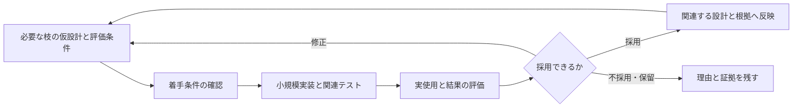

# AIDE v3 設計 — 小さく試し、結果から設計を育てる

**v2の設計工程で作成した、v3の実装に向けた設計です。現在は監査指摘への修正待ちです。** 2026-09-22に4階層・10ノードを正本化しましたが、その後のAstra監査で重大な不足が見つかりました。v3の実行規約・テンプレート一式や製品コードは未実装です。

最新の **Codex CLI / GPT-6 Astraによる独立監査はfail、open major 4件**です。GPT-5.5の過去のpassを現在の受入判定には使いません。[監査結果と実行記録](checks/independent-audit/README.md) と [未処理の変更イベント](changes/events/EV-ASTRA-20260922-01.md) を保存しています。

v3では、必要な枝の仮設計から小規模実装を始め、テストと実使用の結果を設計へ反映します。一度監査した範囲の内部修正は日常確認で進め、意味や責任の境界が変わる時と定期的な節目に監査します。

## 最初に読むもの

| 知りたいこと | 設計の正本 |
| --- | --- |
| 全体の目的、残す構造、分割の理由 | [全体設計 G-V3](root/design.md)・[判断の根拠](root/rationale.md) |
| ファイル構造、読みやすい文書、現在仕様への反映 | [記録 S-RECORD](root/subgoals/sg-model/approaches/a-model/systems/s-record/design.md) |
| 小規模実装の着手条件、テスト・実使用・採否 | [学習 S-CYCLE](root/subgoals/sg-learn/approaches/a-learn/systems/s-cycle/design.md) |
| DDD監査基準、監査の頻度、指摘の終了条件 | [監査 S-AUDIT](root/subgoals/sg-assure/approaches/a-assure/systems/s-audit/design.md) |
| 要求・ログ・仮定の出所 | [設計入力](sources/requirements.md) |
| 今回どこまで確認したか | [設計工程の完了検査](checks/completion.md)・[機械的な最終照合](checks/final-verification.md) |

この文書は案内と要約です。条件の正本はリンク先の設計と根拠です。

## 1. 元の構造をどう残すか

「目標 → 小目標 → アプローチ → システム」は、何のために作るかを説明する骨格として維持します。DDDによる分割は、言葉・状態・判断の責任をどこに置くかに使います。

v3で利用者のプロジェクトを扱う時は、システムの設計正本をドメイン側へ置き、アプローチから参照します。再利用するシステムを複製せず、主たる目的の経路は一つ残します。ドメインの文書を第5階層として挿入することはしません。

今回、**v2を実行して作った設計ツリー**は次の構造です。配置と親の関係はv2の規約に従います。

```text
G-V3  試して学び、意図と現在の状態を説明できる開発
├─ SG-MODEL  意図と現在仕様を人が理解して訂正できる
│  └─ A-MODEL  正本への参照と、同じ文書内の段階的説明
│     └─ S-RECORD  現在仕様・参照・反映を管理する
├─ SG-LEARN  最小の動作を試し、証拠で次の方法を選べる
│  └─ A-LEARN  範囲を固定した実験と、証拠付きの反映
│     └─ S-CYCLE  実験計画・実行結果・採否を管理する
└─ SG-ASSURE  必要な監査だけで意味と整合性を保てる
   └─ A-ASSURE  監査基準版からの差分をDDDの観点で判定する
      └─ S-AUDIT  変更の振り分けと差分監査を管理する
```

三つの境界は、現在仕様、実験の観測、監査の判定という異なる状態を所有します。各枝のアプローチは方式の選択、システムは入出力・状態・失敗時の処理を決めるため、一子の枝でも判断が異なります。利用先の設計にも同じ枝数を要求するものではありません。

## 2. 小規模実装はどこにあるか

小規模実装の作業場所は `src/`、関連するテストは `tests/`、何を試し何が分かったかは `experiments/` です。これらは**将来v3が利用者のプロジェクトに作るもの**で、今回の設計成果のディレクトリとは別です。具体的な配置案はS-RECORDにあります。

一つの実験は「一つの未確認事項を判断するための最小動作」です。必要なら複数システムをまたぎます。



最初に必要なのは、関係する目標チェーン、最小動作、守る条件、仮の境界契約、評価方法、上限、既存の許可範囲です。他の枝の完成を待ちません。試作計画の確認では、これから作る実装のテスト成功を要求しません。

実験結果は実装の版と結び付けます。採用するまで仮説を現在仕様へ混ぜず、失敗や実使用未確認も残します。全体方針が変わった場合にマスターを更新し、局所的な学びは担当する設計と根拠へ反映します。

## 3. 監査をどう減らすか

| 変更・状態 | v3での扱い |
| --- | --- |
| 初回で監査基準がない | 今回の実験に必要な範囲を監査 |
| 監査済みの責任・意味を保つ内部修正 | 関連テストと短い影響確認で進める |
| 用語の意味、責任、守るルール、外部契約などの変更 | 影響範囲を絞って即時監査 |
| 未監査差分があり、定期的な節目に到達 | 最後の監査済み版からの累積差分を監査 |
| 意味が変わらない表記修正 | 根拠を記録。関連テストを該当なしにできる |

周期の初期値は「実験サイクル終了時、または最初の未監査変更から7暦日後の次の作業開始時」の早い方です。これは試行用の仮定で、利用者の指定を優先します。変更がなければ再監査せず、自動スケジューラの導入も前提にしません。

DDDの観点は、共通言語、モデル境界、不変条件と整合性、境界間の関係、モデルと実装の対応です。目的・説明・版と証拠はAIDE固有の基準として追加します。全パターンの導入を要求する方式にはしません。

重大な指摘には基準、具体的な支障、解消条件が必要です。軽微な表現改善だけでは止めません。同じ指摘が2回の修正でも収束しなければ、矛盾と代替案を整理して実験または範囲の見直しへ進めます。回数だけで合格にはしません。

## 4. 議論とログの課題への対応

| 要求・課題 | 設計での対応 | 主な条件ID |
| --- | --- | --- |
| 実物での検証が進まない | 必要な枝だけで着手し、計画・結果・採否を一つの実験で追う | G3、SC1〜SC5 |
| 更新のたびに監査が多い | 日常確認、境界変更時、定期差分監査を分ける | G4、SA1、SA4 |
| ドメイン駆動で分割したい | 4階層の目的と、言葉・責任の境界を併記する | G1、SR1、DDD-01〜04 |
| 元の構造を残す理由を知りたい | 目的の追跡を維持し、横断する再利用は参照にする | G1、AM1 |
| 重複した記録が食い違う | 正本と書込み担当を限定し、採用時に一組で反映する | SR3〜SR5 |
| 説明が抽象的で人が判断できない | 意味・操作例・短い理由を先に置き、詳細と同じ文書で読む | G2、SR2、AIDE-02 |
| 監査が追加要求で終わらない | 基準と対象版を固定し、指摘の解消条件を明示する | G5、SA3〜SA4 |
| 専門知識や毎回の承認が人へ戻る | 方法の選択と反復を既存の委任内で進める | L3、AL2、SC4 |
| 古い合格や結果を使ってしまう | 設計・実装・監査の対象版を照合し、競合なら再評価する | G6、SR4、SC2、SA5 |

ログで扱われた旧複製版の問題を、現行v2すべての欠陥とみなしてはいません。また、この対応表は**設計上の対策**です。実際に時間・監査回数・手戻りが減るか、人が理解しやすくなるかは未検証です。

## 5. v2をどう実行したか

現行の [v2実行規約](../../harness-v2/README.md) に従い、intake → author → decompose → precheck → review → orchestrateを実行しました。ノードの2文書、選択した子の仮文書、検査対象の固定、検査結果、正本化、システム引渡しを保存しています。

構造照合は文書検査の補助処理で行い、ノードを正本化した時点の意味レビューは主担当が行いました。続くGPT-5.5の独立監査はpassでしたが、ユーザー指定のAstraによる再監査はfailでした。過去の検査・公開記録はそのまま残し、最新指摘をv2の変更イベントとして登録しています。修正と再監査の前に、実装への引渡しを合格扱いにはしません。

- [tree-state.md](tree-state.md): 現在の全体版と引渡し先。最終 `tree_revision: 18`。
- `root/`: 10ノードそれぞれの `design.md` と `rationale.md`。
- `closures/manifests/`: 検査・引渡しで固定した入力一覧。
- `closures/inputs/`: 意味の内容から名前を付けた、編集しない検査用の保存物。
- `closures/handoffs/`: システムの引渡し判定。
- `checks/`: 構造検査、自己レビュー、正本化、最終照合の記録。

古い検査対象はその時点の履歴として残し、現在の引渡しはtree-stateが指す3件を使います。v2が要求するこれらの保存物を、v3の利用先に毎回手作業で複製する設計にはしていません。

## 6. 後続工程へ渡すもの

S-RECORD、S-CYCLE、S-AUDITの責任・入出力・失敗処理と、単体・小目標結合・全体結合の将来検証IDを引き渡します。次の工程では、この設計からv3の実行規約とテンプレートを実装し、一つの小さな開発課題でループ全体を試します。

効果の評価対象は、最初の実物までの時間、監査で止まる回数、修正後の手戻り、記録の不一致、利用者が目的・結果・制約を説明できるかです。今回、それらの改善や製品テスト成功を報告する根拠はまだありません。

検査保存物の規約化と照合方法は [検査記録の読み方](checks/README.md) に記載しています。
