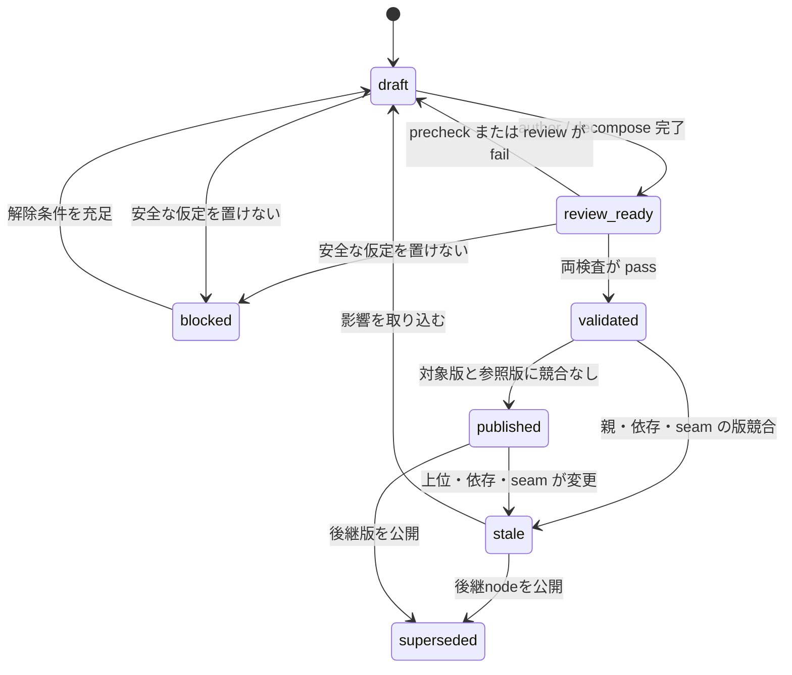
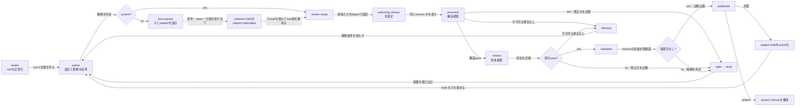

# AIDE v2 設計ハーネス

このディレクトリは、大本の目標を実装可能なシステム設計まで具体化するための実行規約である。
今回の成果物は設計ファイルと設計閉包であり、製品コード、テスト、ビルド、デプロイは作らない。

## 1. 到達点

```text
root_goal（大本の目標）
  └─ subgoal（小目標）
       └─ approach（アプローチ・解決法）
            └─ system（実装対象のシステム設計）
```

各階層は異なる判断を持つため省略しない。枝幅は内容から決め、見た目を揃える目的で
子を増減させない。

```text
root_goal
├─ subgoal A
│  ├─ approach A1
│  │  ├─ system A1a
│  │  └─ system A1b
│  ├─ approach A2
│  │  └─ system A2a
│  └─ approach A3
│     └─ system A3a
├─ subgoal B
│  └─ approach B1
│     ├─ system B1a
│     ├─ system B1b
│     └─ system B1c
└─ subgoal C
   ├─ approach C1
   │  ├─ system C1a
   │  └─ system C1b
   └─ approach C2
      └─ system C2a
```

設計完了後は、将来のハーネスが各 `system` を実装して単体テストを行い、採用された
system 群を `subgoal` ごとの結合テストへ、最後に `root_goal` の最終結合テストへ集約する。
本ハーネスは対応IDまでを設計し、テスト内容やコードは生成しない。

## 2. 不変条件

1. **状態は保存ファイルが持つ。** 実行中だけの情報を設計判断の正本にしない
2. **各ノードは2文書を持つ。** `design.md` は仕様、`rationale.md` はその根拠を持つ
3. **4階層の意味を固定する。** `root_goal → subgoal → approach → system` の順を守る
4. **分岐を内容から決める。** 空、重複、言い換えだけのノードを作らない
5. **親条件を追跡する。** 子へ渡す条件と親に残す統合責任を同時に記録する
6. **横断関係を明示する。** 木の親は1つにし、他の関係は seam と dependency で表す
7. **検査結果で進める。** 構造検査と意味検査に合格した同一版だけを自動公開する
8. **安全な仮定を記録する。** 可逆な仮定で進められない重大な不足だけを `blocked` にする
9. **変更を版で扱う。** 古い親版や依存版に基づく候補を公開しない
10. **今回は設計までに留める。** 実装とテストは将来フェーズへ渡す

## 3. ノードの種類

| kind | この層で決めること | 子の kind |
| --- | --- | --- |
| `root_goal` | 対象者、実現する状態、最終成功条件、不変条件 | `subgoal` |
| `subgoal` | 独立して確認できる価値、達成条件、全体内の境界 | `approach` |
| `approach` | 解決原理、トレードオフ、必要なシステム責務 | `system` |
| `system` | 責務、境界、I/O、状態、失敗、品質条件、受入条件 | なし |

子が1つでも抽象度と判断責任が変わるなら層を作る。同じ内容の言い換えしか生まれない場合は、
親の粒度を修正する。

## 4. 配置と正本

推奨配置は次のとおり。

```text
design-tree/
├─ tree-state.md
├─ root/
│  ├─ design.md
│  ├─ rationale.md
│  └─ subgoals/
│     └─ <subgoal-id>/
│        ├─ design.md
│        ├─ rationale.md
│        └─ approaches/
│           └─ <approach-id>/
│              ├─ design.md
│              ├─ rationale.md
│              └─ systems/
│                 └─ <system-id>/
│                    ├─ design.md
│                    └─ rationale.md
├─ closures/
│  ├─ manifests/
│  │  └─ <closure-id>.md
│  └─ handoffs/
│     └─ <closure-id>.md
└─ changes/
   ├─ events/
   │  └─ <event-id>.md
   ├─ impacts/
   │  └─ <event-id>.md
   └─ invalidations/
      └─ <invalidation-id>.md
```

ディレクトリ構造と frontmatter の `parent` は同じ包含関係を示す。node id はツリー内で
一意かつ安定とし、表示名を変えても再利用しない。

### `tree-state.md`

ツリー全体の競合キーと処理キューを持つ。root node の revision とは分離する。

```yaml
revision: <integer>
tree_revision: <integer>
root_id: <root-node-id>
staged_children:
  - parent_id: <node-id>
    candidate_ref: <candidate-ref>
    child_ids: [<node-id>]
pending_events: [<change-event-id>]
active_invalidations: [<invalidation-id>]
closures:
  - manifest_id: <closure-id>
    target: <system-id>
    status: current | stale
    handoff_id: <handoff-id-or-null>
updated_at: <ISO-8601>
```

`revision` は tree-state の更新ごとに増やし、書込み競合の検出に使う。`tree_revision` は
設計グラフ、公開契約、staged / active membership、invalidation が変わるときだけ増やす。
検査結果や closure 登録だけでは tree revision を増やさない。publish、staged child の生成・
active化、invalidation は読み始めた tree revision と現在値が一致するときだけ反映する。
`pending_events` と `active_invalidations` のIDは `changes/` 配下の同名文書で解決する。

### `design.md`

現在の候補または公開済み仕様を持つ。目的、責務、非責務、振る舞い、I/O、依存、seam、
品質条件、受入条件、子への割当、将来検証IDを書く。

### `rationale.md`

対応する設計版の入力根拠、判断理由、代替案、仮定、リスク、検査結果、変更理由を書く。
生の作業ログを蓄積せず、現在の設計を再検査するために必要な証拠へ要約する。

2文書は同じ `revision` と `design_revision` を持つ1組として更新する。

## 5. 親子エッジ

各親子エッジは、親の条件を子へ配る設計契約である。

| relation | 意味 | 必須性 |
| --- | --- | --- |
| `all_of` | 同じ group の子が共同で親を成立させる | 選択された全子が必須 |
| `one_of` | 同じ group の候補から選択する | 選択規則を満たす1子が必須 |
| `optional` | 成功条件外の拡張 | 未採用でも親は完了可能 |

各 child entry は `id`、`relation`、`group`、`selected`、`responsibility`、
`expected_outcome`、割り当てる `acceptance` と `constraints` を持つ。

- `all_of` は `selected: true` とする
- `one_of` は group を必須とし、同じ group 内でちょうど1つを `selected: true` にする
- `optional` は採用状態を明示する
- 未選択候補の比較内容は `rationale.md` に残し、必須の設計完了条件へ含めない
- `review-ready` 以降の design の children は selected かつ staged materialize 済みの子だけを参照する
- 複数の子にまたがる条件は親が統合条件として保持する

decompose は precheck より前に選択済み child の2文書を staged stub として作る。staged child は
親が published になるまで authoring 対象にせず、親の公開と同じ論理更新で active にする。

## 6. 状態モデル

| status | 意味 | 次の標準動作 |
| --- | --- | --- |
| `draft` | 起草または修正中 | `author`、非葉は続けて `decompose` |
| `review-ready` | 検査対象の版を固定済み | `precheck`、次に `review` |
| `validated` | 同じ版の構造・意味検査が pass | `orchestrate` が競合確認 |
| `published` | 現在有効な正本 | 子を進める、system は closure を作る |
| `blocked` | 根拠ある候補に不可欠な外部事実がない | 解除条件を満たしたら `draft` |
| `stale` | 上位、依存、seam の変更で再検査が必要 | 影響を反映して `draft` |
| `superseded` | 過去に published だった node が後継nodeへ置き換えられた | 読み取り専用 |

標準遷移は次のとおり。



文書では `review-ready` を使う。Mermaid の `review_ready` は識別子上の表記である。
検査不合格は `rationale.md` へ finding と完了条件を記録し、`draft` へ戻す。

`handoff-ready` は node status ではない。published system の immutable closure に対応する
別レコードの `result: pass` という派生判定で表す。

## 7. 実行ロール

| role | 責任 |
| --- | --- |
| `intake` | 入力を1つの `root_goal` へ正規化する |
| `author` | 対象ノードの design と rationale を起草・改訂する |
| `decompose` | 非葉を必要数の子へ分け、条件と relation を割り当てる |
| `precheck` | 形式、参照、階層、被覆、版整合を検査する |
| `review` | 目的適合、十分性、境界、実装可能性を意味検査する |
| `orchestrate` | 次の処理を選び、validated 版を公開し、完了を判定する |

ロールは実行上の操作であり、設計ツリーの子ノードにはしない。

## 8. 設計フロー



## 9. revision と競合

- `revision`: 2文書の論理更新ごとに増やす
- `design_revision`: 設計、根拠、分解候補の意味が変わったときに増やす
- `parent_revision`: 候補が前提とした親の design revision
- `base_revision`: 操作開始時に読み取った対象 revision

`base_revision` は各ロールが2文書を書き戻すときの楽観ロックであり、長期間の検査同一性には
使わない。precheck / review は immutable な authoring closure IDを共有する。このIDは対象
design revision、親 design revision、dependency design revision、seam revision、tree revision、
意味 digest を束ねる。

公開直前に closure の全意味版と tree revision を再確認し、orchestrator が読み取った通常
revision も書込み時に一致する場合だけ反映する。不一致なら `stale → draft` として最新閉包で
再検査する。無条件上書きや新旧版の部分混在を正常完了として扱わない。

## 10. 設計閉包

対象ノードの権威的入力を設計閉包と呼ぶ。

```text
設計閉包 = root_goal から対象までの design.md + rationale.md
         + 経路から参照される dependency の公開契約
         + seam owner が持つ完全な契約と参加ノードの参照
         + 明示的に参照された外部根拠と invalidation
         + design / seam / tree の意味版と semantic digest
```

manifest は `design-tree/closures/manifests/<closure-id>.md` に immutable に保存する。
IDは `CL-<target>-d<design-revision>-t<tree-revision>-<digest-prefix>` とし、digest はID自身を
除く規約化manifest全体から計算する。status、通常 revision、finding、validation result など
workflow metadata は semantic digest から除外する。

precheck / review の結果は同じ closure IDとともに `rationale.md` へ記録する。published system の
handoff 結果は manifest を変更せず、`design-tree/closures/handoffs/<closure-id>.md` に保存する。
対象または参照する意味版が変わった閉包と結果は失効させ、新しいIDで再構成する。

seam の完全な契約は owner node の `owned_seams` にだけ置く。from / to node は `seam_refs` で
id、owner、revision、producer / consumer role を参照する。

## 11. 変更の波及

変更は一意な event id、基準 tree revision、対象、旧版、変更した条件・seam、理由を持つ。

| 変更 | 再検査する範囲 |
| --- | --- |
| 目的、成功条件、不変条件 | 条件を継承する子孫と関係する祖先 |
| 子への責務・条件割当 | 対象の子、その子孫、親の統合条件 |
| dependency または seam 契約 | 利用側、提供側、影響する子孫 |
| 意味を変えない表記修正 | なし。根拠を記録する |

影響集合に含まれる node を `stale` とし、旧版を含む system closure を失効させる。
再設計版は通常の検査・公開フローを通す。

## 12. 設計完了条件

- root から、選択されたすべての必須 system へ到達できる
- 必須ノードがすべて `published` である
- 必須経路に `draft`、`review-ready`、`validated`、`blocked`、`stale` がない
- すべての親条件が子または親の統合責任へ割り当てられている
- すべての参照、dependency、seam の両端と版が解決している
- 各 current system closure に対応する handoff result が `pass` である
- 各 system に unit、各 subgoal に integration、root に final integration の対応IDがある
- 保存ファイルだけから各 system の責務と存在理由を再構成できる

## 13. 将来フェーズへの引渡し

system closure は将来の作成ハーネスへ次を渡す。

- system id、design revision、目標チェーン
- 責務と非責務
- 外部 I/O、状態、エラー、境界条件
- dependency と seam の契約
- セキュリティ、性能、運用、データなどの品質条件
- 観測可能な受入条件
- 実装時に選択できる範囲
- `unit_test_id`、`subgoal_integration_id`、`final_integration_id`

引渡し後に作るものは次の順で対応する。

```text
system → 実装 + 単体テスト
選択された system 群 → subgoal 結合テスト
subgoal 結合結果群 → root_goal 最終結合テスト
```

## 14. ファイル一覧

| ファイル | 用途 |
| --- | --- |
| [node-template.md](node-template.md) | 各ノードの `design.md` テンプレート |
| [rationale-template.md](rationale-template.md) | 各ノードの `rationale.md` テンプレート |
| [roles/intake.md](roles/intake.md) | 入力を root へ正規化する |
| [roles/author.md](roles/author.md) | ノードを起草・改訂する |
| [roles/decompose.md](roles/decompose.md) | 非葉を非対称に分解する |
| [roles/precheck.md](roles/precheck.md) | 構造検査を行う |
| [roles/review.md](roles/review.md) | 意味検査を行う |
| [roles/orchestrate.md](roles/orchestrate.md) | 公開、子生成、閉包、完了を管理する |
| [criteria/README.md](criteria/README.md) | 共通品質基準 |
| [criteria/precedents.md](criteria/precedents.md) | 再利用する設計前例 |
| [examples/bookstore.md](examples/bookstore.md) | 非対称な具体例 |

## 15. 対象外

- ソースコード生成
- テストケース、テストコード、fixture、実行設定の生成
- ビルド、デプロイ、監視
- 特定ベンダーやモデルに依存する実行制御
