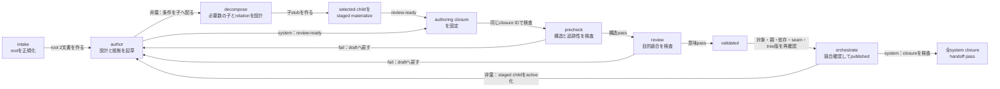

# 具体例: オンライン書店の非対称な設計ツリー

## 大本の目標

利用者が欲しい本を発見し、誤りなく購入し、配送状況を把握しながら確実に受け取れる。

この例は、すべての枝を同じ数に揃えず、目的に必要な判断数に応じて分解する。

## 全体図

```mermaid
flowchart TB
    G["root_goal<br/>本を発見・購入し<br/>確実に受け取れる"]

    SG_FIND["subgoal<br/>欲しい本を発見できる"]
    SG_BUY["subgoal<br/>誤りなく注文・決済できる"]
    SG_RECEIVE["subgoal<br/>配送を把握して受け取れる"]

    G -->|"all_of：利用者成果へ分解"| SG_FIND
    G -->|"all_of：利用者成果へ分解"| SG_BUY
    G -->|"all_of：利用者成果へ分解"| SG_RECEIVE

    A_SEARCH["approach<br/>キーワードで直接探す"]
    A_BROWSE["approach<br/>分類をたどって探す"]
    A_RECOMMEND["approach<br/>履歴から候補を提示する"]
    A_PURCHASE["approach<br/>購入トランザクションを一貫管理する"]
    A_SHIP["approach<br/>配送会社と連携して追跡する"]
    A_NOTIFY["approach<br/>重要な変化を通知する"]

    SG_FIND -->|"all_of：直接検索を設計"| A_SEARCH
    SG_FIND -->|"optional・採用：分類閲覧を加える"| A_BROWSE
    SG_FIND -->|"optional・採用：候補提示を加える"| A_RECOMMEND
    SG_BUY -->|"all_of：注文成立を一貫管理"| A_PURCHASE
    SG_RECEIVE -->|"all_of：荷物の状態を把握"| A_SHIP
    SG_RECEIVE -->|"optional・採用：変化を通知"| A_NOTIFY

    S_QUERY["system<br/>検索クエリAPI"]
    S_INDEX["system<br/>全文検索インデックス"]
    S_CATALOG["system<br/>商品カタログ"]
    S_RECOMMENDER["system<br/>推薦エンジン"]
    S_BEHAVIOR["system<br/>行動イベントストア"]

    A_SEARCH -->|"all_of：要求受付を所有"| S_QUERY
    A_SEARCH -->|"all_of：索引を所有"| S_INDEX
    A_BROWSE -->|"all_of：分類と書誌を所有"| S_CATALOG
    A_RECOMMEND -->|"all_of：候補計算を所有"| S_RECOMMENDER
    A_RECOMMEND -->|"all_of：推薦材料を所有"| S_BEHAVIOR

    S_CART["system<br/>カートサービス"]
    S_ORDER["system<br/>注文ワークフロー"]
    S_PAYMENT["system<br/>決済アダプター"]

    A_PURCHASE -->|"all_of：購入前の選択を所有"| S_CART
    A_PURCHASE -->|"all_of：注文状態を所有"| S_ORDER
    A_PURCHASE -->|"all_of：外部決済境界を所有"| S_PAYMENT

    S_FULFILL["system<br/>出荷指示サービス"]
    S_CARRIER["system<br/>配送会社アダプター"]
    S_TRACKING["system<br/>配送追跡プロジェクション"]
    S_POLICY["system<br/>通知判定サービス"]
    S_MESSAGE["system<br/>メッセージ配信"]

    A_SHIP -->|"all_of：倉庫への指示を所有"| S_FULFILL
    A_SHIP -->|"one_of・採用：配送会社差を吸収"| S_CARRIER
    A_SHIP -->|"all_of：追跡状態を所有"| S_TRACKING
    A_NOTIFY -->|"all_of：通知判断を所有"| S_POLICY
    A_NOTIFY -->|"all_of：配信を所有"| S_MESSAGE

    classDef design fill:#DBEAFE,stroke:#2563EB,color:#172554,stroke-width:2px
    class G,SG_FIND,SG_BUY,SG_RECEIVE,A_SEARCH,A_BROWSE,A_RECOMMEND,A_PURCHASE,A_SHIP,A_NOTIFY,S_QUERY,S_INDEX,S_CATALOG,S_RECOMMENDER,S_BEHAVIOR,S_CART,S_ORDER,S_PAYMENT,S_FULFILL,S_CARRIER,S_TRACKING,S_POLICY,S_MESSAGE design
```



青は現在の設計対象である。`optional・採用` の枝はこの例では current tree に含むが、
未採用なら rationale の代替案だけに残す。

## 将来の検証対応

以下は対応関係の可視化であり、現在は黄色部分を作成しない。

```mermaid
flowchart TB
    SQ["検索クエリAPI"] -. "実装して単体検証" .-> UQ["UT-S-QUERY"]
    SI["全文検索インデックス"] -. "実装して単体検証" .-> UI["UT-S-INDEX"]
    SC["商品カタログ"] -. "実装して単体検証" .-> UC["UT-S-CATALOG"]
    SR["推薦エンジン"] -. "実装して単体検証" .-> UR["UT-S-RECOMMENDER"]
    SB["行動イベントストア"] -. "実装して単体検証" .-> UB["UT-S-BEHAVIOR"]

    SCT["カートサービス"] -. "実装して単体検証" .-> UCT["UT-S-CART"]
    SO["注文ワークフロー"] -. "実装して単体検証" .-> UO["UT-S-ORDER"]
    SP["決済アダプター"] -. "実装して単体検証" .-> UP["UT-S-PAYMENT"]

    SF["出荷指示サービス"] -. "実装して単体検証" .-> UF["UT-S-FULFILL"]
    SCR["配送会社アダプター"] -. "実装して単体検証" .-> UCR["UT-S-CARRIER"]
    ST["配送追跡プロジェクション"] -. "実装して単体検証" .-> UT["UT-S-TRACKING"]
    SNP["通知判定サービス"] -. "実装して単体検証" .-> UNP["UT-S-POLICY"]
    SM["メッセージ配信"] -. "実装して単体検証" .-> UM["UT-S-MESSAGE"]

    UQ -. "小目標の条件で結合" .-> IF["SIT-SG-FIND"]
    UI -. "小目標の条件で結合" .-> IF
    UC -. "小目標の条件で結合" .-> IF
    UR -. "小目標の条件で結合" .-> IF
    UB -. "小目標の条件で結合" .-> IF

    UCT -. "小目標の条件で結合" .-> IB["SIT-SG-BUY"]
    UO -. "小目標の条件で結合" .-> IB
    UP -. "小目標の条件で結合" .-> IB

    UF -. "小目標の条件で結合" .-> IR["SIT-SG-RECEIVE"]
    UCR -. "小目標の条件で結合" .-> IR
    UT -. "小目標の条件で結合" .-> IR
    UNP -. "小目標の条件で結合" .-> IR
    UM -. "小目標の条件で結合" .-> IR

    IF -. "root成功条件へ集約" .-> FINAL["FIT-G-BOOKSTORE"]
    IB -. "root成功条件へ集約" .-> FINAL
    IR -. "root成功条件へ集約" .-> FINAL

    classDef current fill:#DBEAFE,stroke:#2563EB,color:#172554,stroke-width:2px
    classDef future fill:#FEF3C7,stroke:#D97706,color:#451A03,stroke-width:2px
    class SQ,SI,SC,SR,SB,SCT,SO,SP,SF,SCR,ST,SNP,SM current
    class UQ,UI,UC,UR,UB,UCT,UO,UP,UF,UCR,UT,UNP,UM,IF,IB,IR,FINAL future
```



- 青: 現在設計する system
- 黄: 将来作る単体テスト、小目標結合テスト、最終結合テスト
- 点線: 現在の設計で予約する対応関係

## 非対称性

| subgoal | approach 数 | system 数 | 理由 |
| --- | ---: | ---: | --- |
| 本を発見できる | 3 | 5 | 検索・閲覧・推薦で入力、状態、変更理由が異なる |
| 注文・決済できる | 1 | 3 | 利用者成果は1つのトランザクションだが、状態と外部境界を分ける |
| 配送を把握して受け取れる | 2 | 5 | 荷物の状態管理と利用者通知は失敗責任・変更頻度が異なる |

`3 → 1 → 2` の approach 数になっている。1つしかない `A_PURCHASE` も省略しない。
`subgoal` は達成する状態、`approach` は採用する解決原理で、決める内容が異なるためである。

### `one_of` の選択例

`A-SHIP` の rationale では、配送会社との同期方式を次のように比較する。published design には
選択した `S-CARRIER` だけを残す。

```yaml
group: carrier-sync
relation: one_of
candidates:
  - id: S-CARRIER
    selected: true
    expected_outcome: 配送会社のイベントを準リアルタイムで共通状態へ変換できる
  - id: S-CARRIER-BATCH
    selected: false
    expected_outcome: 一定間隔で配送状態を取得して共通状態へ変換できる
selection_criterion: 状態変化を利用者へ遅延なく示し、外部API負荷を抑える
reason: 対応事業者がイベント配信を提供し、ポーリングより遅延と呼出回数を抑えられる
```

## ディレクトリ例

```text
design-tree/root/
├─ design.md
├─ rationale.md
└─ subgoals/
   ├─ discover-books/
   │  ├─ design.md
   │  ├─ rationale.md
   │  └─ approaches/
   │     ├─ keyword-search/
   │     │  └─ systems/
   │     │     ├─ search-query-api/
   │     │     └─ fulltext-index/
   │     ├─ catalog-browse/
   │     │  └─ systems/
   │     │     └─ product-catalog/
   │     └─ recommendations/
   │        └─ systems/
   │           ├─ recommender/
   │           └─ behavior-events/
   ├─ complete-purchase/
   │  ├─ design.md
   │  ├─ rationale.md
   │  └─ approaches/
   │     └─ purchase-transaction/
   │        └─ systems/
   │           ├─ cart/
   │           ├─ order-workflow/
   │           └─ payment-adapter/
   └─ receive-order/
      ├─ design.md
      ├─ rationale.md
      └─ approaches/
         ├─ shipment-tracking/
         │  └─ systems/
         │     ├─ fulfillment-command/
         │     ├─ carrier-adapter/
         │     └─ tracking-projection/
         └─ delivery-notification/
            └─ systems/
               ├─ notification-policy/
               └─ message-delivery/
```

省略表示した各 approach / system ディレクトリにも、実際には `design.md` と `rationale.md` がある。

## 追跡例

| root 受入条件 | subgoal | approach | system owner |
| --- | --- | --- | --- |
| `G-AC-01` 書名・著者等から購入可能な本へ到達できる | `SG-FIND` | `A-SEARCH` | `S-QUERY`, `S-INDEX` |
| `G-AC-02` 購入対象と金額を確定し、支払結果を得られる | `SG-BUY` | `A-PURCHASE` | `S-CART`, `S-ORDER`, `S-PAYMENT` |
| `G-AC-03` 出荷後の状態と受取完了を利用者が把握できる | `SG-RECEIVE` | `A-SHIP`, `A-NOTIFY` | `S-FULFILL`, `S-CARRIER`, `S-TRACKING`, `S-POLICY`, `S-MESSAGE` |

root の条件を全 system へ複製しない。各階層で、そのノードが保証する部分条件へ具体化する。

## ノード対の例

### `S-PAYMENT/design.md` の要点

- 責務: 注文ワークフローから決済要求を受け、外部決済事業者との差異を吸収し、確定結果を返す。
- 非責務: カート内容の決定、注文状態の最終所有、配送開始。
- 入力: `payment-request(order_id, amount, currency, idempotency_key)`。
- 出力: `authorized | declined | pending | indeterminate` と provider reference。
- 状態: 冪等性キーと外部結果の対応。注文状態そのものは所有しない。
- 失敗: timeout を失敗確定とみなさず `indeterminate` として照会可能にする。
- seam: `ORDER_PAYMENT_V1`。所有者は `A-PURCHASE`。

### `S-PAYMENT/rationale.md` の要点

- 決済事業者固有の状態を注文ワークフローへ漏らさないため、adapter 境界を置く。
- timeout 時に即時失敗へ倒す案は、外部側だけ成功した二重決済リスクがあるため採用しない。
- 1 system に独立させるのは、外部契約・セキュリティ制約・変更頻度が注文内部と異なるため。
- 再検討トリガーは、決済事業者を内製化する、または非同期照会を提供できなくなること。
- 実装方式、テストライブラリ、リトライ回数の最適値は後続で選べる範囲として制約化する。

このように「何を作るか」と「なぜその境界・振る舞いなのか」を別ファイルで保持する。

## 設計の進め方



各操作は対象 `node_id`、base revision、設計閉包、next action を入力として実行する。

## `S-PAYMENT` の引き渡し例

```yaml
closure_id: CL-S-PAYMENT-d4-t18-83ba91c2
manifest_digest: 83ba91c2b5a0
closure_kind: system
based_on_tree_revision: 18
target:
  id: S-PAYMENT
  design_revision: 4
  parent_design_revision: 3
goal_chain:
  root_goal: G-BOOKSTORE
  subgoal: SG-BUY
  approach: A-PURCHASE
  system: S-PAYMENT
edges:
  - parent: G-BOOKSTORE
    child: SG-BUY
    relation: all_of
    group: required-outcomes
    acceptance: [G-AC-02]
    constraints: [G-C-01]
  - parent: SG-BUY
    child: A-PURCHASE
    relation: all_of
    group: purchase-method
    acceptance: [SG-BUY-AC-01]
    constraints: [SG-BUY-C-01]
  - parent: A-PURCHASE
    child: S-PAYMENT
    relation: all_of
    group: purchase-systems
    acceptance: [PAYMENT-AC-01, PAYMENT-AC-02]
    constraints: [PAYMENT-C-01]
files:
  - {path: design-tree/root/design.md, node_id: G-BOOKSTORE, design_revision: 3, semantic_digest: a13f}
  - {path: design-tree/root/rationale.md, node_id: G-BOOKSTORE, design_revision: 3, semantic_digest: b72c}
  - {path: design-tree/root/subgoals/complete-purchase/design.md, node_id: SG-BUY, design_revision: 4, semantic_digest: c308}
  - {path: design-tree/root/subgoals/complete-purchase/rationale.md, node_id: SG-BUY, design_revision: 4, semantic_digest: d84e}
  - {path: design-tree/root/subgoals/complete-purchase/approaches/purchase-transaction/design.md, node_id: A-PURCHASE, design_revision: 3, semantic_digest: e051}
  - {path: design-tree/root/subgoals/complete-purchase/approaches/purchase-transaction/rationale.md, node_id: A-PURCHASE, design_revision: 3, semantic_digest: f96a}
  - {path: design-tree/root/subgoals/complete-purchase/approaches/purchase-transaction/systems/payment-adapter/design.md, node_id: S-PAYMENT, design_revision: 4, semantic_digest: 07bd}
  - {path: design-tree/root/subgoals/complete-purchase/approaches/purchase-transaction/systems/payment-adapter/rationale.md, node_id: S-PAYMENT, design_revision: 4, semantic_digest: 18ce}
dependencies:
  - id: S-ORDER
    design_revision: 5
acceptance_ids:
  - PAYMENT-AC-01
  - PAYMENT-AC-02
seams:
  - id: ORDER_PAYMENT_V1
    owner: A-PURCHASE
    revision: 2
    canonical_path: design-tree/root/subgoals/complete-purchase/approaches/purchase-transaction/design.md
future_verification:
  unit_test_id: UT-S-PAYMENT
  subgoal_integration_id: SIT-SG-BUY
  final_integration_id: FIT-G-BOOKSTORE
```

handoff はmanifestを変更せず、別ファイルへ保存する。

```yaml
handoff_id: HO-CL-S-PAYMENT-d4-t18-83ba91c2
closure_id: CL-S-PAYMENT-d4-t18-83ba91c2
result: pass
checked_system_design_revision: 4
checked_tree_revision: 18
finding_ids: []
```

これは後続工程への入力契約であり、この例の中で実装やテストを開始したことを意味しない。
